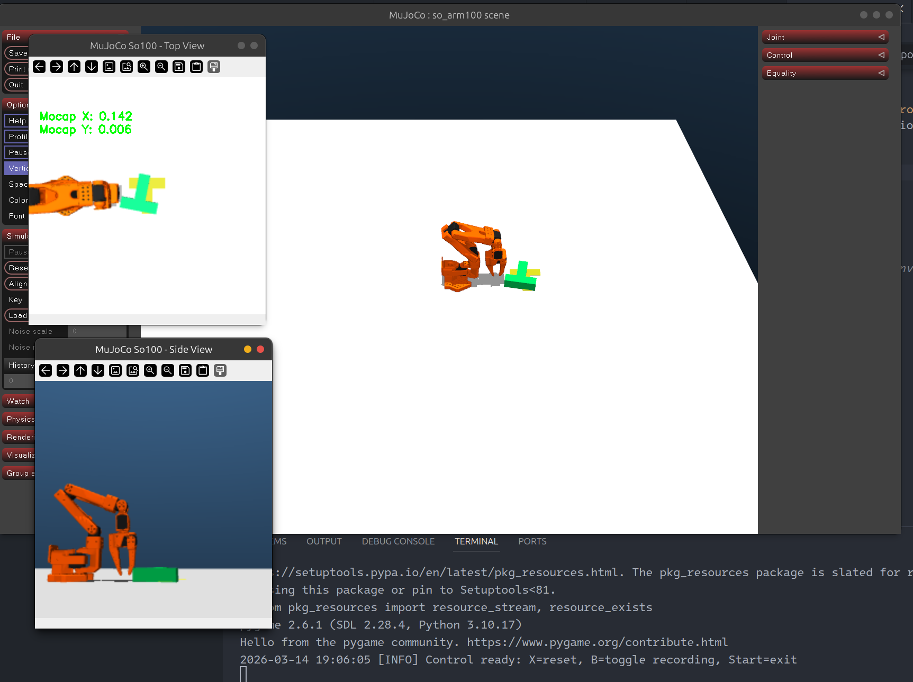
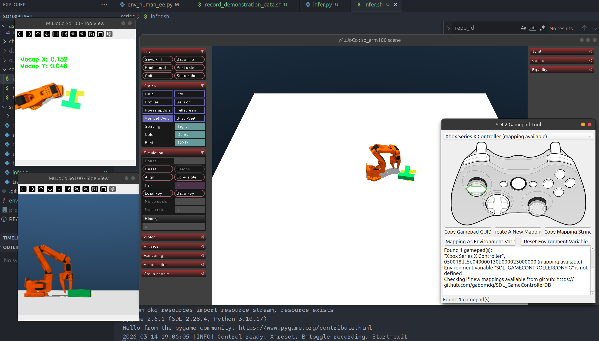
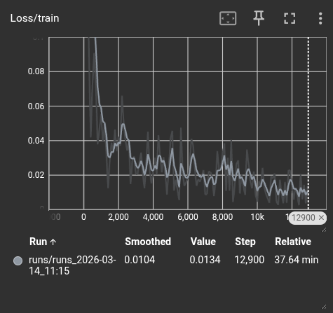
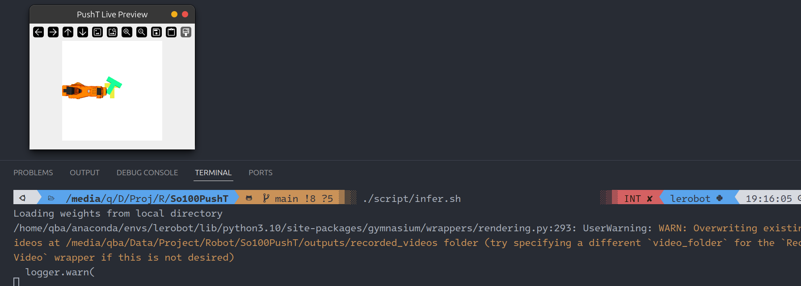

# MuJoCo SO100 PushT: Diffusion Policy Implementation

This repository provides a complete pipeline for the **PushT task** using the **SO100 robotic arm** within the **MuJoCo** physics engine. It features a Gymnasium-compatible environment, teleoperation for data collection, and training/inference workflows following the **LeRobot 4.4** ecosystem.



## 📂 Project Structure

```bash
├── chernyadev/               # Assets and MJCF models
│   └── ... /trs_so_arm100    # Specific SO100 scene configurations (scene.xml, test_env.xml)
├── data/                     # Dataset storage
│   ├── NewData*/             # processed demonstration  datasets
├── script/                   # Automation utilities
│   ├── record_demonstration_data.sh # Script for batch data collection
│   ├── infer.sh              # Script for eval policy
│   └── train_policy.sh       # Script for training policy
├── src/                      # Core source code
│   ├── env_human_*.py        # Teleop interfaces (EE/Servo) for data collection
│   ├── env_gym_*.py          # Gymnasium wrappers for training/inference
│   ├── train.py              # Diffusion Policy training pipeline (LeRobot 4.0)
│   ├── infer.py        # Model evaluation and inference testing
│   └── helper.py             # Common utilities and environment helpers
└── outputs/                  # Training and evaluation results
    ├── ckpt/                 # Model checkpoints
    ├── runs/                 # TensorBoard logs and training metrics
    └── recorded_videos/      # Renders of policy evaluation episodes

```

---

## 🚀 Workflow Guide

### 1. Environment Setup

The project relies on `mujoco`, `gymnasium`, and the `lerobot` (v4.4) library. 
run `conda env create -f environment.yml` to setup env.

### 2. Human Demonstration Collection

Use `src/env_human_ee.py` to collect high-quality demonstrations via a game controller (e.g., Xbox/PS5). This script maps joystick input to the **End-Effector (EE)** delta positions in MuJoCo.




```bash
./script/record_demonstration_data.sh
```

### 3. Data Processing (LeRobot 4.4)

The collected data is converted into the **LeRobot dataset format** (Zarr/Parquet), ensuring compatibility with modern imitation learning pipelines. This includes generating the necessary metadata for the Diffusion Policy.

you can use `lerobot-dataset-viz` to viz your dataset likes this:

``````
lerobot-dataset-viz --repo-id <your-data-path>  --episode-index 12
``````

by the way, I also upload my own dataset to huggingface,if you don't want to record data by yourself, you can download my data from here [qian1dqs/so100-pusht](https://huggingface.co/datasets/qian1dqs/so100-pusht)

### 4. Policy Training

We utilize the **Diffusion Policy** (CNN-based) to learn the multimodal distribution of the PushT task.

```bash
./script/train.sh
```

I trained this model on a A100 for 1000 epochs.Model is available on [huggingface](https://huggingface.co/qian1dqs/so100-pusht-diffusion) too.

loss curve:



### 5. Evaluation & Inference

Run `src/infer.py` to load a trained checkpoint and test its performance in the MuJoCo simulation. The script provides real-time rendering to visualize the agent's behavior.

```bash
./script/infer.sh
```


